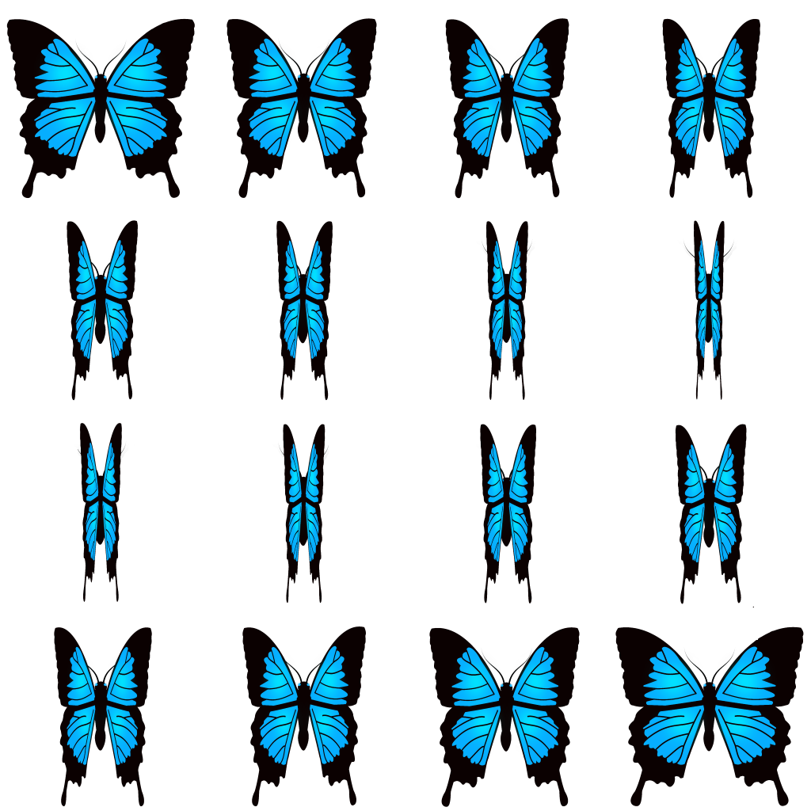

Rotating Disc:
TODO

Keybinds:
* `L` - Rotate disc left one frame
* `R` - Rotate disc right one frame
* `A` - Rotate disc automatically

Animated spritesheet:

Source material:
* [Rotating Disc](https://opengameart.org/content/sweet-colorful-candies-free-game-assest) (Modified)
* [Butterfly Spritesheet](https://opengameart.org/content/butterfly-animation)
